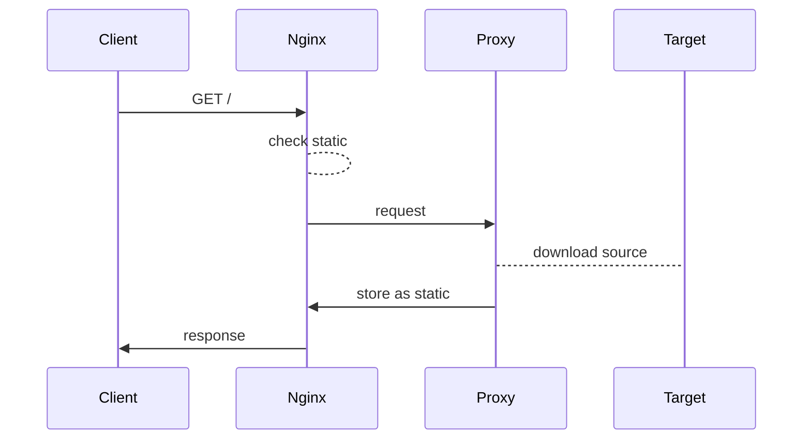

# Custom cached HTTPS reverse proxy with Docker

```mermaid
sequenceDiagram
    Client->>Nginx: GET /
    Nginx-->Nginx: check static
    Nginx->>Proxy: request
    Proxy-->Target: download source
    Proxy->>Nginx: store as static
    Nginx->>Client: response
```