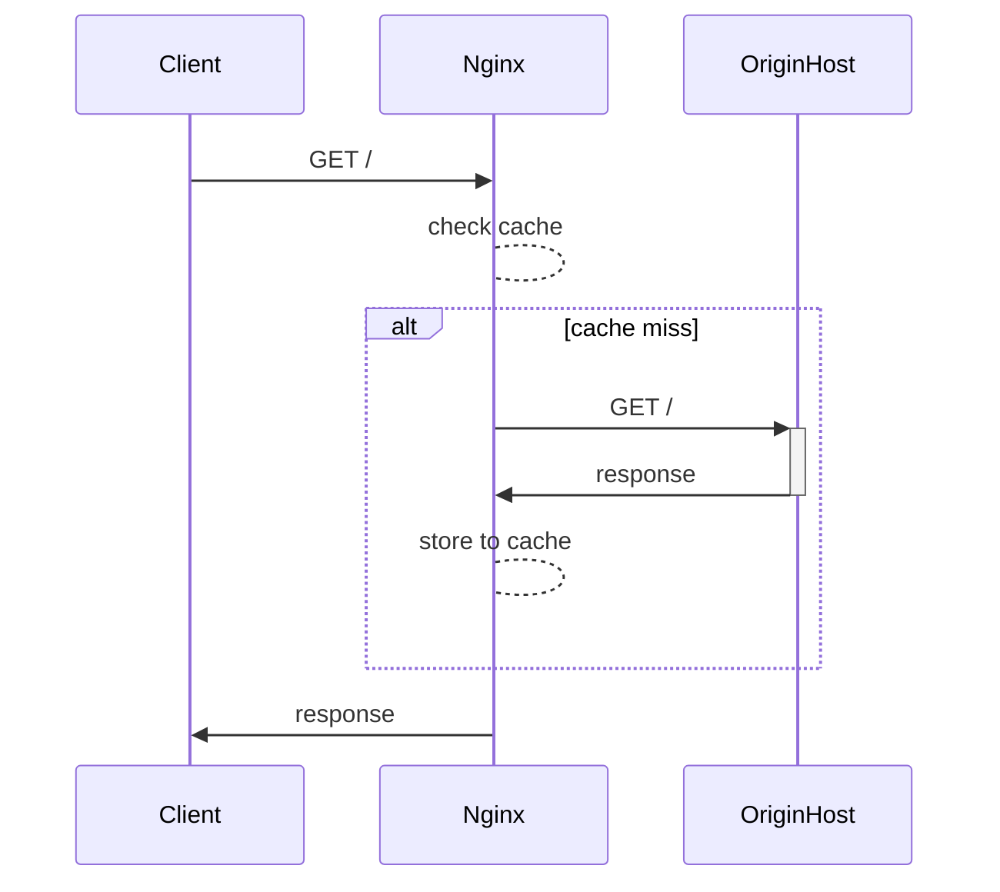

# Cached HTTPS reverse proxy with Docker

```mermaid
sequenceDiagram
    Client->>Nginx: GET /
    Nginx-->Nginx: check cache
    alt cache miss
    Nginx->>+OriginHost: GET /
    OriginHost->>-Nginx: response
    Nginx-->Nginx: store to cache
    end
    Nginx->>Client: response
```