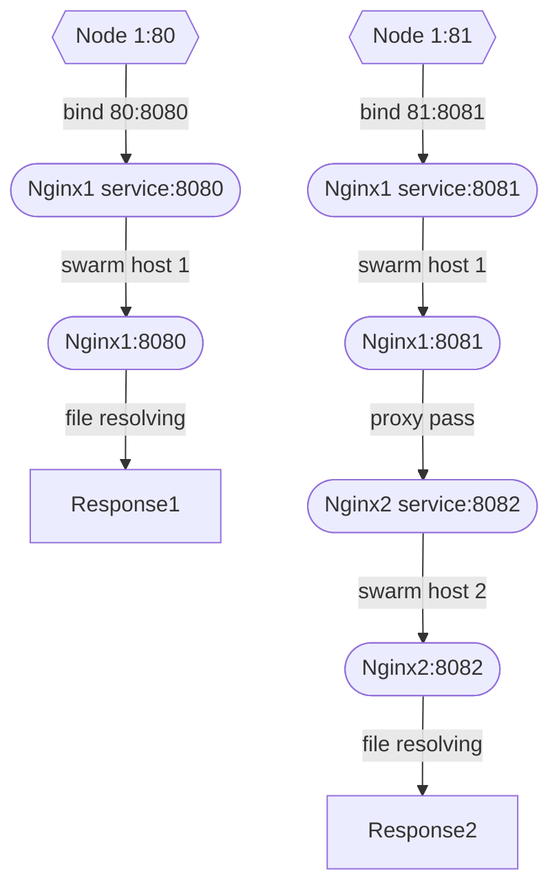

# Docker network with Swarm



### Steps to reproduce stack
Based on official manuals: 
- https://docs.docker.com/engine/swarm/
- https://docs.docker.com/network/network-tutorial-overlay/#use-the-default-overlay-network

1. Create a swarm manager in your first host (it will be a manager): ` docker swarm init --advertise-addr <ZeroTier host IP>`
2. Check port is open:
``` 
$ sudo lsof -PiTCP -sTCP:LISTEN | grep 2377`
dockerd    836            root   32u  IPv6  23543      0t0  TCP *:2377 (LISTEN)
```
3. On second host join to cluster with command been outputs from swarm init:
```
docker swarm join --token <from output> <ZeroTier host IP>:2377
```
4. Check all nodes been visible for manager `docker node ls`
5. Create network on manager host `docker network create -d overlay experiment`
6. Check new network been created `docker network ls`
7. Setup labels for nodes (with ids from node list):
``` 
docker node update --label-add TAG=host1 <node id>
docker node update --label-add TAG=host2 <node id>
```
8. Deploy stack: `docker stack deploy -c ./docker-compose.yml exp`
9. Check all
    - show services `docker stack services exp`
    - if any problem with some service `docker service ps --no-trunc exp_nginx-1`
    - if needs to remove deployed stack `docker stack rm exp`


### Result:
```
# curl localhost:80
<h1> Nginx from node 1 </h1>

# curl lcoalhost:81
<h1> Nginx from node 2 </h1>
```